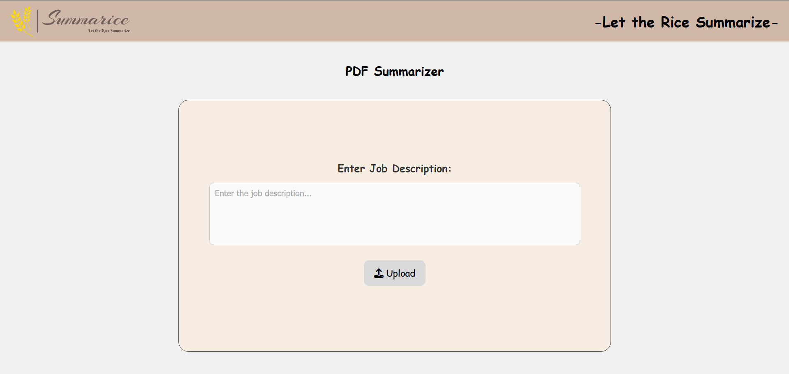
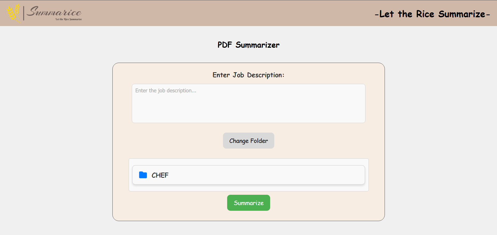

# 📄 PDF Summarize AI Project

ยินดีต้อนรับสู่ **PDF Summarize** แอปพลิเคชันที่ใช้ปัญญาประดิษฐ์ (AI) ในการสรุปเนื้อหาจากไฟล์ PDF ช่วยให้คุณเข้าถึงข้อมูลสำคัญได้รวดเร็วและแม่นยำ

## ตัวอย่าง




## 📌 คุณสมบัติที่สำคัญ

- **สรุปเนื้อหาอัตโนมัติ**: ใช้โมเดล AI เพื่อดึงประเด็นสำคัญจากเอกสาร PDF อย่างรวดเร็ว
- **อินเทอร์เฟซที่ใช้งานง่าย**: ออกแบบให้ทุกคนใช้งานได้ง่าย สะดวก รวดเร็ว
- **รองรับการอัปโหลดไฟล์ PDF**: สามารถเลือกไฟล์ PDF จากคอมพิวเตอร์ของคุณได้ทันที

## 🚀 วิธีการติดตั้ง

1. โคลนโปรเจกต์ไปยังเครื่องของคุณ:

   ```bash
   git clone https://github.com/Celimine09/PDF-Summarice.git
   ```

2. ติดตั้ง dependencies:

   ```bash
   npm install
   ```

3. เรียกใช้งานโปรเจกต์:

   ```bash
   npm start
   ```

4. เปิดเบราว์เซอร์แล้วไปที่:

   ```bash
   http://localhost:3000
   ```

## 🛠️ เทคโนโลยีที่ใช้

- **AI Model**
- **Python**
- **HTML+CSS**
- **JavaScript**

## ✨ ผู้จัดทำ

- **Front-end**: Jirattakiet, Nattanan
- **Back-end**: Cholnatee, Thananon, Nattanan
- **Model AI**: Techatorn

ขอบคุณที่สนใจในโปรเจกต์นี้!😊

